

  

  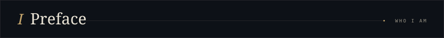

  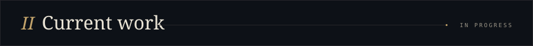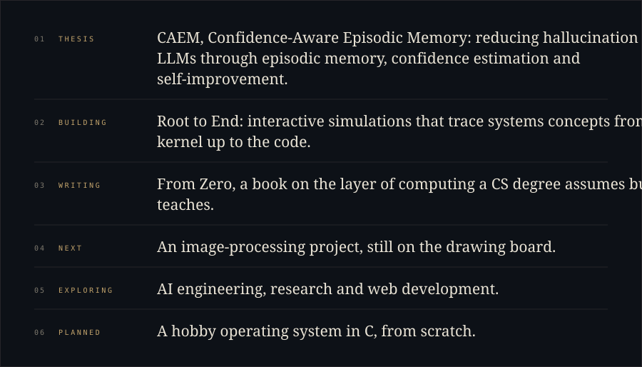

  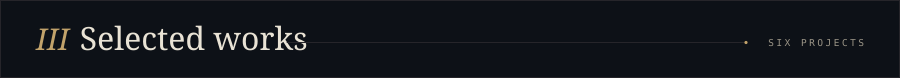

  <a href="https://github.com/aksaN000/caem-thesis">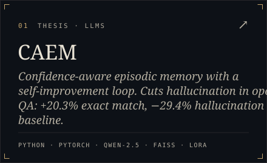</a>
  <a href="https://github.com/aksaN000/Sam2-sar-Flood-mapping">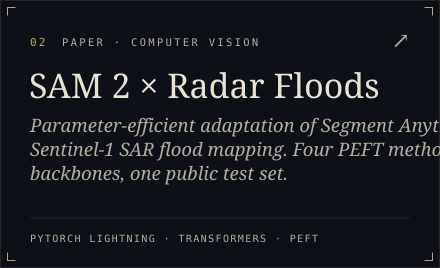</a>
  <a href="https://github.com/aksaN000/memestack">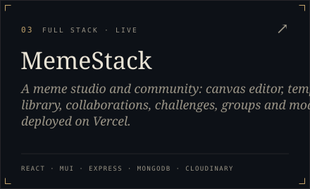</a>
  <a href="https://github.com/aksaN000/vae-music-clustering">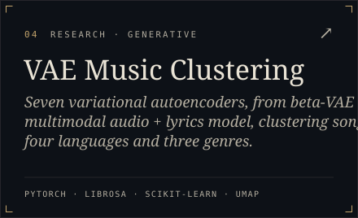</a>
  <a href="https://github.com/aksaN000/Continual-Learning">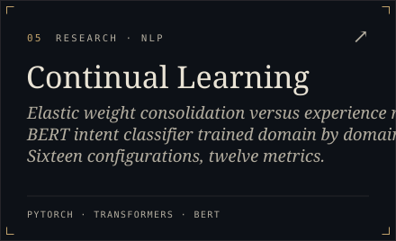</a>
  

  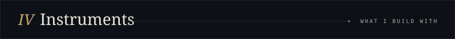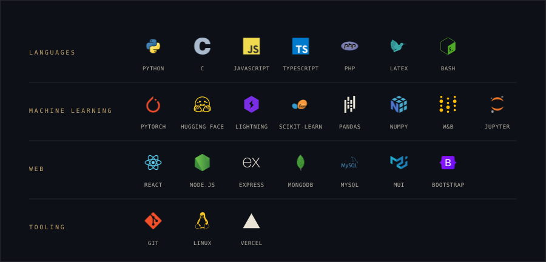

  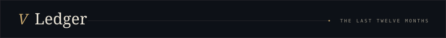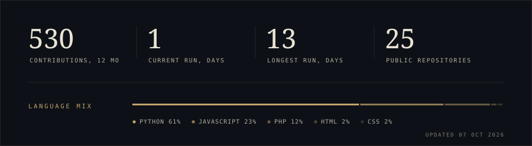

  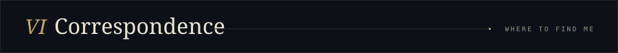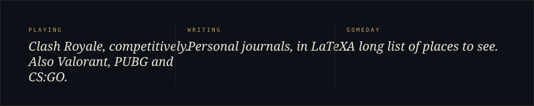

  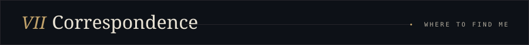

  <a href="mailto:aksangoni.alif@gmail.com">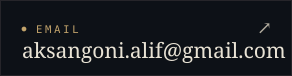</a>
  <a href="https://www.linkedin.com/in/aizaz-alif-b137aa1b7/">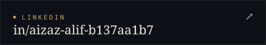</a>
  <a href="https://github.com/aksaN000">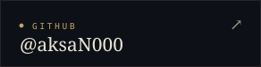</a>
  <a href="https://www.facebook.com/aksan.alif55">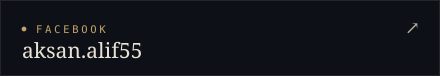</a>

  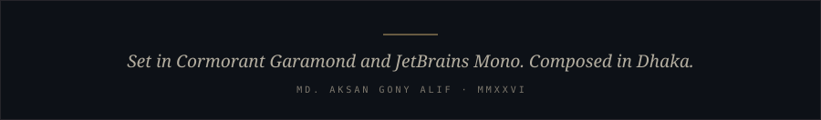

